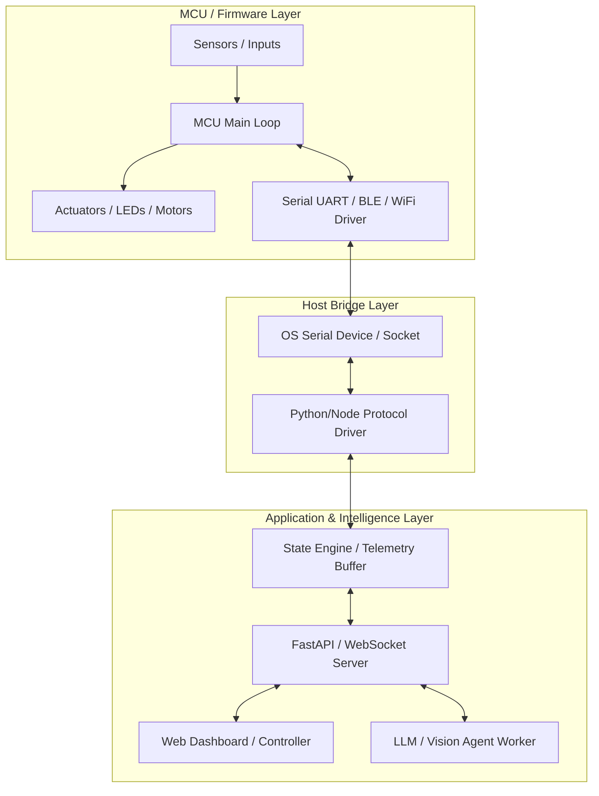

# System Architecture & Technical Specification

## 1. System Overview

This project connects physical microcontroller hardware (sensors + actuators) with high-level software services (AI agent reasoning, real-time telemetry, and web UI controls).



---

## 2. Communication Protocol Layer

### Recommended Transport: Serial JSON-Lines
To ensure both ease of debugging and high throughput during a hackathon, packets use **Newline-Delimited JSON (JSON-Lines)** over 115200 baud Serial:

- **Baud Rate**: 115200 bps
- **Framing**: UTF-8 encoded JSON string terminated by `\n`
- **Telemetry (MCU -> Host)**:
  ```json
  {"type": "telemetry", "seq": 102, "timestamp": 123456, "data": {"sensor_a": 24.5, "sensor_b": 1013}}
  ```
- **Command (Host -> MCU)**:
  ```json
  {"type": "command", "cmd": "SET_OUTPUT", "params": {"target": "actuator_1", "value": 1}}
  ```
- **Acknowledgment (MCU -> Host)**:
  ```json
  {"type": "ack", "cmd": "SET_OUTPUT", "status": "ok"}
  ```

See full details in [docs/PROTOCOL.md](docs/PROTOCOL.md).

---

## 3. Simulator Mode (Mock-first)

When `SIMULATE_HARDWARE=true`:
1. Software bypasses physical serial device scanning.
2. A virtual mock worker simulates periodic sensor readings and responds to host commands.
3. This decouples software/UI development from physical breadboard / soldering work.

---

## 4. Error Handling & Recovery

| Failure Scenario | Recovery Behavior |
| --- | --- |
| Physical cable unplugged | Host driver logs warning, enters reconnect loop (backoff: 1s, 2s, 5s) |
| Corrupt frame received | Discard frame, increment CRC/parsing error counter, do not crash loop |
| Command timeout | Retry command up to 3 times before raising alert to UI / Agent |
