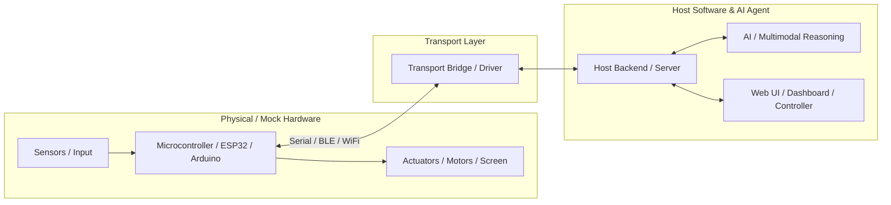

# Shenzhen Hackathon — Hardware-Software Integration Project

> **SZ Hackathon 2026-09-19** · High-velocity hardware-software integrated prototype.

---

## 1. Quick Start

### Step 1: Clone & Configure
```bash
cp .env.example .env
# Edit .env for your SERIAL_PORT (or leave SIMULATE_HARDWARE=true for local simulation)
```

### Step 2: Run Software with Mock Simulator
```bash
# Terminal 1: Run virtual hardware simulator
python3 scripts/mock_hardware.py

# Terminal 2: Run software host service / UI
bash scripts/dev.sh
```

### Step 3: Flash MCU (When ready for physical hardware)
```bash
bash scripts/flash_firmware.sh
```

---

## 2. Architecture Overview



See [ARCHITECTURE.md](ARCHITECTURE.md) and [docs/PROTOCOL.md](docs/PROTOCOL.md) for frame specifications.

---

## 3. Directory Layout

```text
├── AGENTS.md            # Agent routing, commands, and rules
├── ARCHITECTURE.md      # System design, data flow, state machine
├── PRD.md               # Hackathon product definition & demo script
├── .env.example         # Parameter templates & hardware configs
├── hardware/            # Schematics, pinouts, BOM
│   ├── PINOUT.md
│   └── BOM.md
├── firmware/            # Embedded code (ESP32 / Arduino / PlatformIO)
├── software/            # Host service, protocol bridge, API, UI
├── docs/                # Protocol specs, API documentation
│   └── PROTOCOL.md
└── scripts/             # Dev, flash, simulator, and test scripts
    ├── mock_hardware.py
    ├── dev.sh
    └── flash_firmware.sh
```

---

## 4. Hardware Specifications

- **MCU**: ESP32 / STM32 / Arduino compatible
- **Baud Rate**: `115200`
- **Transport**: USB-UART Serial / WiFi / BLE
- Details in [hardware/PINOUT.md](hardware/PINOUT.md) and [hardware/BOM.md](hardware/BOM.md).
